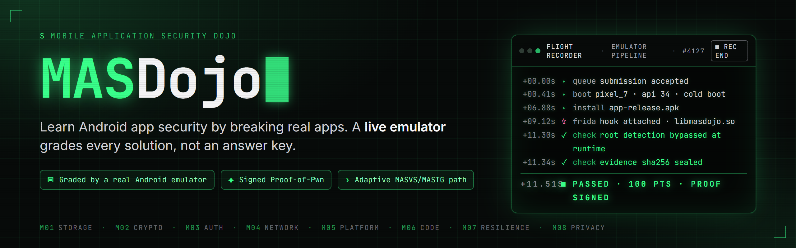
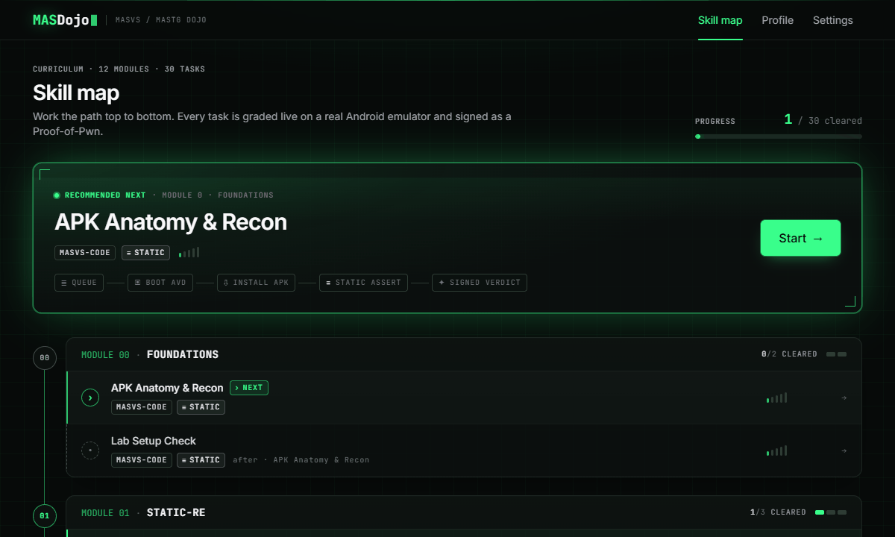

<p align="center">
  
</p>

<p align="center">
  
  
  
</p>

# MASDojo, Mobile App Security Dojo

MASDojo is a self-hostable platform for learning Android application penetration
testing. It turns the OWASP MASVS and MASTG body of knowledge into a set of
hands-on challenges, and every challenge is checked by an automated grader that
confirms you actually applied the technique instead of guessing a flag.

The idea is simple. Each task gives you a deliberately vulnerable target app, a
clear objective, and a grader. You do the work (recover a secret, write a Frida
script, capture a request), then you submit your result. The grader runs your
submission and returns a pass or a fail together with the individual checks it
performed, so you always see exactly what held up and what did not.

<p align="center">
  
</p>

## How the grading loop works

For tasks that need a device, the runner boots a real Android emulator, restores
a clean snapshot, installs the target APK, applies your submission, and grades
the result on the live device. This is the core idea of MASDojo: the emulator is
the answer key, so a task is complete only when a real run verifies your solution,
not when you decide you got it.

Many tasks also grade in dry run mode straight from committed artifacts (decoded
resources, prefs and log and backup dumps, real encrypted blobs, captured
traffic). That means you can work through most of the curriculum on a plain
laptop, with no emulator and no build toolchain, and still get the same
pass or fail verdict.

## What makes it different

1. **Graders, not self assessment.** A task is done when its grader passes. Every
   verdict lists the checks it ran, so a pass is always explainable.
2. **The emulator is the answer key.** Device backed tasks are verified on a real
   Android emulator, so you cannot fake a result.
3. **A live grading console.** For device backed tasks the runner streams every
   step of the pipeline (snapshot restore, `adb install`, Frida injection,
   mitmproxy capture, and each check) so the final verdict is traceable to what
   produced it.
4. **Signed Proof of Pwn certificates.** Every pass issues a signed certificate
   that anyone can check at a public `/verify` endpoint. The certificate binds the
   verdict to the task, the learner, and a digest of the evidence, so a pass is a
   portable, verifiable proof of skill.
5. **Anti memorization challenges.** Many tasks are seeded per learner, so two
   people get different secrets and sharing an answer does not help. The reward
   flags are also obfuscated inside the APKs, so running `strings` over the binary
   does not shortcut a challenge. You have to apply the technique.
6. **An adaptive path.** Tasks form a prerequisite graph across twelve modules. A
   pathway engine recommends your next task based on what you have mastered, how
   many hints you used, and how long you took.
7. **An optional AI mentor (bring your own key).** Plug in your own Anthropic or
   OpenAI key, or point it at any OpenAI compatible gateway, to unlock tiered
   Socratic hints, plain language explanations of a smali or Frida error, and a
   remediation review after you pass. Keys are encrypted at rest and used only on
   the server, and the platform is fully functional without a key.
8. **Defensive education only.** Every target app is an intentionally vulnerable
   training artifact authored in this repository. There is no real malware and no
   third party or copyrighted app.

## Quickstart

### On your own laptop (workshop or solo mode), no cloud and no login

Everything runs locally, and live Frida or RASP grading uses your own machine's
Android emulator, so you do not need a nested virtualization host. Full setup and
troubleshooting live in [`docs/preflight.md`](docs/preflight.md) and
[`docs/local-mode.md`](docs/local-mode.md).

```bash
git clone <your-fork-url> masdojo && cd masdojo
make doctor        # check your machine has everything, and report what is missing
make solo          # open http://localhost:5173, no login, straight into the curriculum
```

`make solo` already covers Lab 1 (reverse engineering and secrets) and Lab 3 (API
abuse), neither of which needs an emulator. For Lab 2 (live Frida and RASP), add a
local device:

```bash
make avd-up        # create a rooted local AVD and a matching frida-server
make avd-check     # confirm it is ready
make runner-host   # grade against your local AVD in attach mode
```

### Hosted, for multiple users

The grading runner boots an Android emulator, so it needs a host with KVM enabled
(nested virtualization). The database, Redis, backend, and frontend run anywhere
Docker runs. See [Runner and KVM](#runner-and-kvm) below.

```bash
git clone <your-fork-url> masdojo && cd masdojo
make env           # write .env with fresh JWT and master key secrets
make apps          # build the vulnerable target APKs (in Docker, no host SDK needed)
make up            # start the full stack: db, redis, backend, frontend, runner
```

Then open <http://localhost:5173>, register a local account, and start at
Module 0.

If you do not have a KVM host (for example on a Mac), everything except the
emulator runner still runs:

```bash
make up-core       # db, redis, backend, frontend, without the runner
```

You can still browse the whole interface and use the AI mentor. To exercise the
grading loop without an emulator, run the runner in dry run mode, which grades
`flag` and `static_assert` tasks against server side expected values. For the full
emulator path on a KVM box, see [`docs/deploy-kvm.md`](docs/deploy-kvm.md).

To enable the AI mentor, open Settings, then AI Key, and save an Anthropic or
OpenAI key. For a custom endpoint (a proxy or an OpenAI compatible gateway), set
`OPENAI_BASE_URL` and `OPENAI_MODEL` (or the `ANTHROPIC_*` equivalents) in `.env`.
See [`.env.example`](.env.example) for every option.

## Architecture

```
        +------------+        +------------------------------+
        |  frontend  |  HTTP  |            backend            |
        | React + TS | <----> |   FastAPI, auth, pathway      |
        +------------+        |   engine, mentor proxy        |
                              +------+----------------+-------+
                                     |                |
                             +-------v------+  +-------v------+
                             |  PostgreSQL  |  |    Redis     |
                             | users, tasks |  |   grading    |
                             | submissions  |  |  job queue   |
                             +--------------+  +-------+------+
                                                       | consumes jobs
                                              +--------v---------+
                                              |      runner      |  KVM host
                                              | AVD, adb, Frida  |
                                              | mitmproxy, grader|
                                              +------------------+
```

| Component | Stack | Responsibility |
|-----------|-------|----------------|
| `frontend/` | React, TypeScript, Vite, Tailwind | Dashboard skill map, task view, hint panel, live grading, bring your own key settings |
| `backend/` | FastAPI, SQLAlchemy, Pydantic, loguru | Auth (JWT), task API, pathway engine, AI mentor proxy, key management |
| `runner/` | Python worker | Boots and snapshots the AVD, installs the APK, injects Frida, captures with mitmproxy, runs graders |
| `tasks/` | YAML and Python graders | Self contained curriculum task packages |
| `apps/` | Kotlin | Source for the intentionally vulnerable training apps |
| `infra/` | Docker | Compose files, Dockerfiles, AVD build, seed scripts |
| `docs/` | Markdown | Architecture, authoring guide, MASVS coverage, demo assets |

Design notes live in [`docs/architecture.md`](docs/architecture.md).

## Curriculum

There are twelve modules, numbered 0 to 11, ordered so each one builds the
prerequisites for the next, and together they cover all eight MASVS v2 categories.
The full mapping is in [`docs/masvs-coverage.md`](docs/masvs-coverage.md).

| Module | Domain | MASVS focus |
|--------|--------|-------------|
| 0. Foundations and Tooling | `foundations` | MASVS-CODE (awareness) |
| 1. Static Analysis and RE | `static-re` | MASVS-STORAGE-1, MASVS-CODE |
| 2. Local Data Storage | `storage` | MASVS-STORAGE-1/2 |
| 3. Cryptography | `crypto` | MASVS-CRYPTO-1/2 |
| 4. Dynamic Instrumentation | `rasp-bypass` | MASVS-RESILIENCE (intro) |
| 5. Network and Interception | `network` | MASVS-NETWORK-1/2 |
| 6. SSL Pinning Bypass | `rasp-bypass` | MASVS-NETWORK-2, MASVS-RESILIENCE |
| 7. Auth and API Abuse | `api-dynamic` | MASVS-AUTH-1/2 |
| 8. Platform Interaction and IPC | `platform` | MASVS-PLATFORM-1/2/3 |
| 9. RASP and Anti Tampering | `rasp-bypass` | MASVS-RESILIENCE-1 through 4 |
| 10. Privacy and Data Sharing | `privacy` | MASVS-PRIVACY-1 |
| 11. Capstone | `capstone` | Cross MASVS |

All 30 tasks ship a grader that verifies the technique was applied, not just that
a flag matched. Most grade in dry run from committed artifacts (decoded resources,
prefs and log and backup dumps, real encrypted blobs, captured traffic), so you do
not need an emulator or an APK build to solve them. The reference tasks (`001`,
`005`, `009`) additionally run on a live emulator.

Module 9 is a full tour of Runtime Application Self Protection techniques. It
covers root detection, emulator and sandbox detection, debugger detection through
ptrace and TracerPid (backed by a real native self ptrace guard, not a toy check),
anti Frida instrumentation detection, signature and tamper integrity checks,
string encryption as an anti analysis layer, and a local Play Integrity style
attestation stub. Each one is its own task with its own bypass.

Adding a new comparison grader is usually a one line change through
[`runner/runner/graders.py`](runner/runner/graders.py). See
[`tasks/_template/`](tasks/_template/) and [`docs/authoring.md`](docs/authoring.md)
for the full authoring workflow.

## Grading model

Each task declares a `success_type`. The runner returns a
`GradeResult(passed, evidence, checks, score)`.

| `success_type` | What you submit | What the grader asserts |
|----------------|-----------------|-------------------------|
| `flag` | A string | Constant time match against the expected flag |
| `static_assert` | An extracted value such as a secret or an endpoint | The value was genuinely present in the target |
| `frida_assert` | A Frida script | A hook fired, or a guarded function's return was flipped |
| `network_assert` | A network interaction | A specific endpoint, parameter, or auth bypass was exercised, observed through mitmproxy |

Every grading job is sandboxed, network restricted, and given a hard timeout.

## Runner and KVM

The emulator runner needs hardware accelerated virtualization.

- A Linux host with `/dev/kvm` is the supported path. The runner container is
  launched with `--device /dev/kvm`.
- If KVM is not available inside containers, run the runner on bare metal against
  the same Redis and Postgres. See
  [`docs/architecture.md`](docs/architecture.md#runner-on-bare-metal).

## Adding a task

Copy [`tasks/_template/`](tasks/_template/) to a new directory under `tasks/`.
The authoring workflow, which covers the `task.yaml` schema, the grader contract,
the hint tiers, and building the target app, is documented in
[`docs/authoring.md`](docs/authoring.md).

## License

[Apache-2.0](LICENSE).
